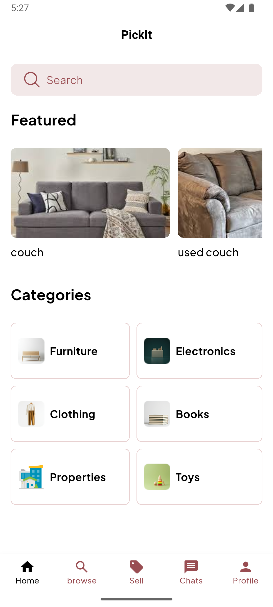
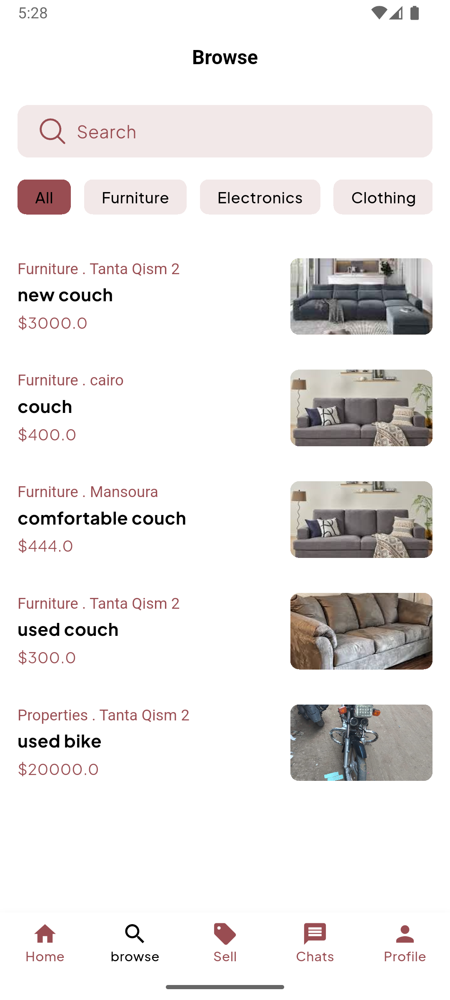
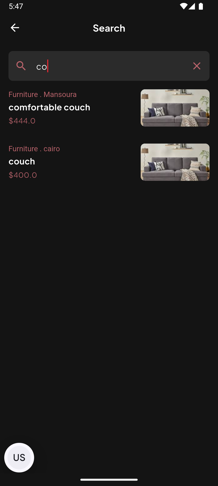
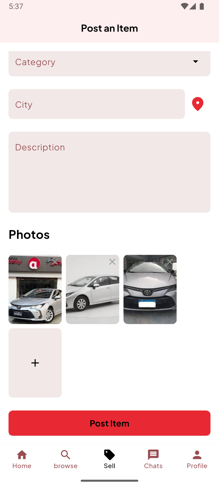
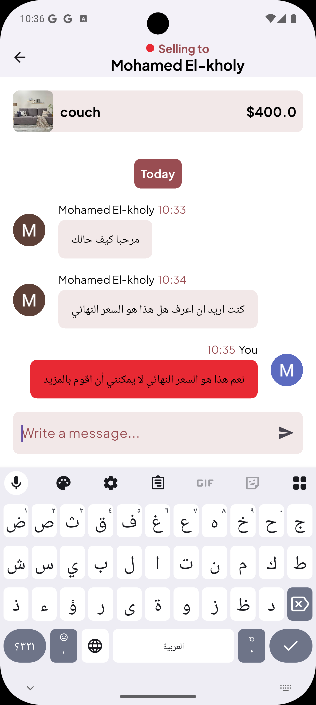
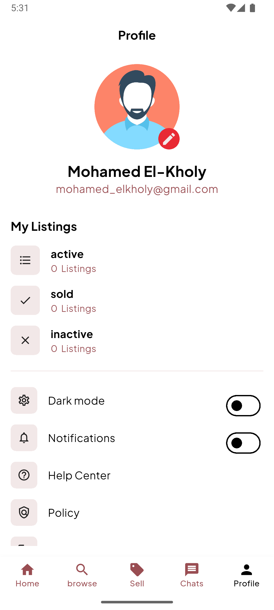
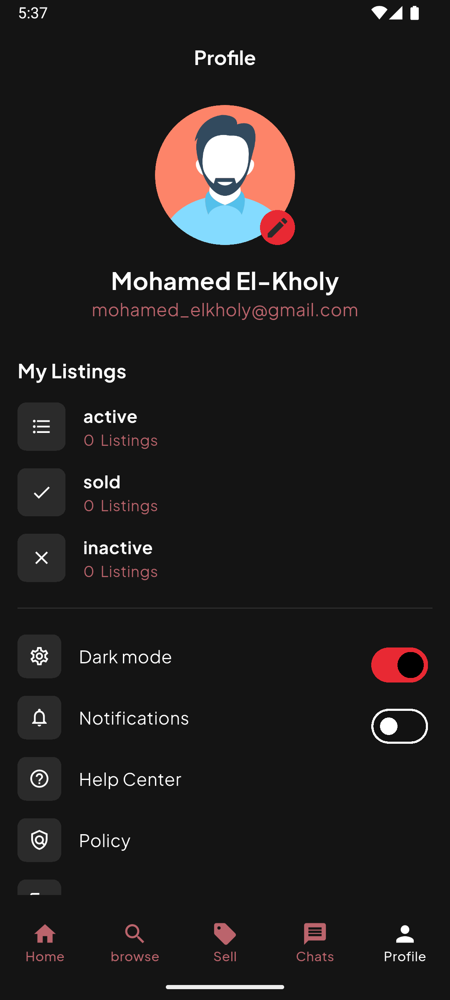
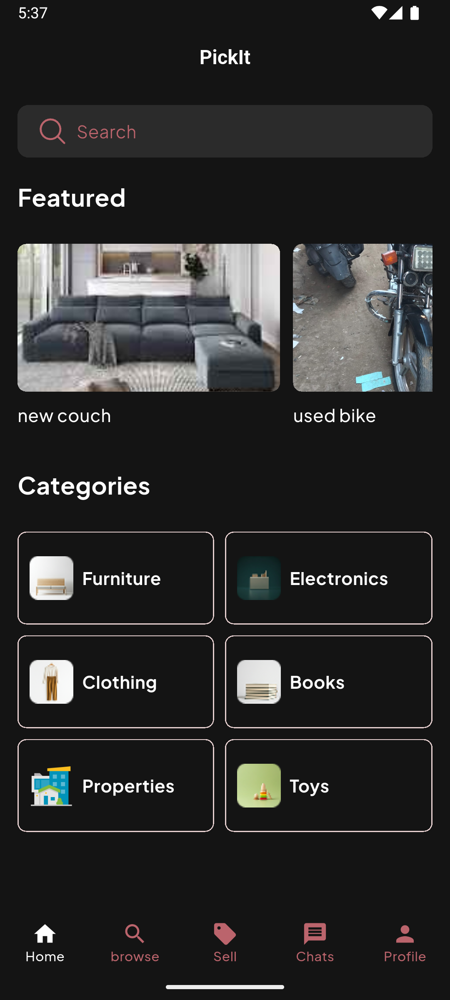
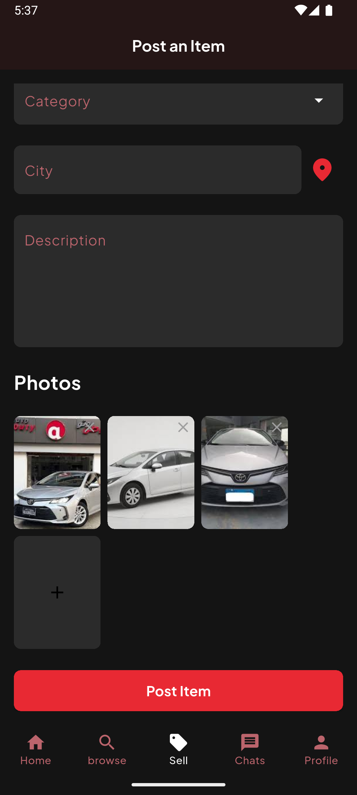

# 🛍️ Pickit

Buy-and-sell marketplace app with item listings, secure user authentication, and real-time chat. Built with Flutter using Firebase Authentication and Cloud Firestore for user accounts and live messaging. Uses Cubit with the MVVM architecture for clean state management and reliable data flow. Includes custom theming, optimized image loading with CachedNetworkImage, and push notifications for instant updates. Provides an intuitive, modern chat interface to connect buyers and sellers seamlessly.

## 📲 Features

- 🔍 ** Browse & Search**
  - Easily browse items by categories and find exactly what you need with search.
     
  
  &nbsp; &nbsp; &nbsp;&nbsp;&nbsp;&nbsp;&nbsp;
  

- 📤 **Post Your Items**
  - Take your photos, add details, set your price, and post your item in seconds.
    
  

- 💬 **In-App Chat**
  - Communicate with buyers and sellers without leaving the app.
     
    
    &nbsp; &nbsp; &nbsp;&nbsp;&nbsp;&nbsp;&nbsp;
    
    
- 👤 **User Profile**
  - Sign up, log in, and manage your profile with Firebase Authentication.
    
  

- 🌙 **Dark Mode**
  - Fully supports light and dark themes for a smooth user experience day and night.
    
  
  &nbsp; &nbsp; &nbsp;&nbsp;&nbsp;&nbsp;&nbsp;
  
  &nbsp; &nbsp; &nbsp;&nbsp;&nbsp;&nbsp;&nbsp;
  
  &nbsp; &nbsp; &nbsp;&nbsp;&nbsp;&nbsp;&nbsp; 

  
## ⚙️ Tech Stack

- **Language:** Dart / Flutter
- **Architecture:** BLoC / Cubit
- **State Management:** flutter_bloc
- **Backend:** (Firebase Authentication / Cloud Firestore)
- **Packages Used:**
  - `geolocator`
  - `geocoding`
  - `smooth_page_indicator`
  - `flutter_animate`
  - `firebase_auth`
  - `cloud_firestore`
  - `flutter_dotenv`

## 📥 APK
📥 Download Demo APK: [Google Drive Link](https://drive.google.com/drive/folders/1JMw4ZD-2NGNkZ4SMCJAYWd24klKG92_W?usp=drive_link)
